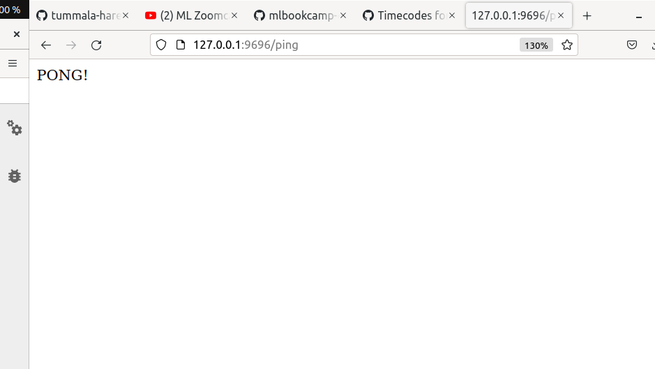
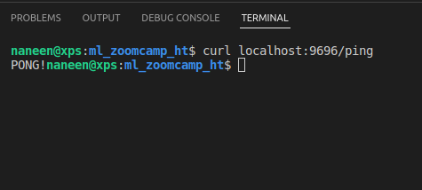
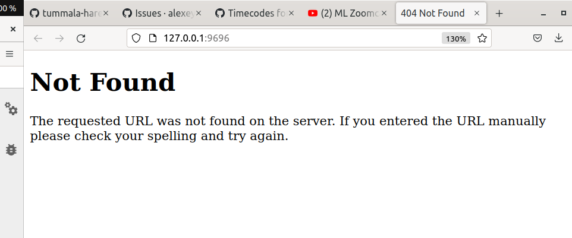
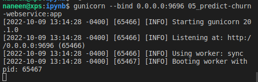
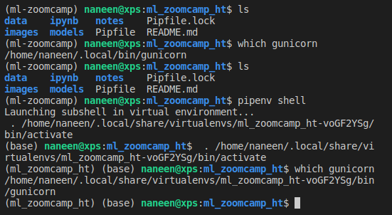

# Week-5
These notes prepared during week-5 of ML Zoomcamp. 

# 1 Intro / Session overview
- Deploying ML models
- Previously trained churn prediction model, and deploy it to production 
- Import churn prediction code from previous weeks
- How to use the model from jupyter notebook? 
    - Jupyter notebook - model 
    - Save as `model.bin`
    - Load above model using Webservice - Churn service Model 
    - Marketing Service - has info on user - Sends requests to Churn service model 
    - Marketing service sends emails
- Churn-Prediction-Model -> Web Service -> Flask -> PipEnv -> docker -> cloud AWS EB

# 2 Saving and loading the model
- Save the model into pickle
- Loading the model from pickle
- Turning notebook into python script

# 3 Web services: introduction to Flask
- Writing a simple ping/pong app 
- Quering it with `curl` and browser
- `Web Service` 
    - method for communicating two devices over a network using some protocol 
    - E.g: Flask 
- Example simple webservice:
    - send /ping  -> web service -> return pong
- Install `Flask`
- Create app -> Add decorator (GET method) -> app.run(debug=True, host=0.0.0.0, port=9696) -> app.run should be in __main__
- Open `http://127.0.0.1:9696/ping` in webbrowser


- Use `curl` command below to communicate with webservice
    ```sh
        curl localhost:9696/ping
    ```
- Reponse is:



# 4 Serving the churn model with Flask
- Predict python script into a webservice
- Churn Service (Model) /predict -> Marketing Service (send customer) -> Returns auc
- `POST` method to send customer information for churn app
- customer info. will be sent in JSON format 
- Reponse will also be JSON 
- Important:    
    - We should inform flask that json is being sent as input
    - For inputs: use request to get_json() object 
    - For ouputs: use jsonify to convert dict to json object
- Browser sends GET request and we will get below error

- ERROR=<500>
    - Object of type Bool is not json serializable
    - Change numpy bool variable into python bool 
        - var_bool -> bool(var_bool)
    - change numpy float into python float 
        - var_float -> float(var_float)
- If Flask is run in `DEBUG` mode, it reloads the server after every change to app file 
- ERROR=<200>
    - Successful 
    - User .json() to 
## Development server vs Production server
- `gunicorn` for production
- Use below command to tell gunicorn to run churn webservice 
- __main__ will not be executed when run from `gunicorn`. So, we are no more in debug mode
```sh
    gunicorn --bind 0.0.0.0:9696 05_predict-churn-webservice:app
```

- Our churn prediction webservice is running in a production environment locally. 


# 5 Python virtual environment: Pipenv
- Managing virtual env - `pipenv`
- 2 scenarios
    - Churn Service - scikit-learn==0.24.2
    - Lead Scoring Service - scikit-learn==1.0  
- `pipenv` is widely accepted in python community 
- Using `pipenv` (instead of `pip`) to install python libraries in a virtual env will create 2 files
    - Pipfile
    - Pipfile.lock
        - Exact version of dependecies that we used 
        - Checksum to fixes and pins 
        - Use for `Reproducability`
        - 
- When someoneelse clones this repo, they just do a (to arrive at the same state as we are working now!)
```sh
pipenv install 
```
- Active the venv that is used 
```sh
pipenv shell
```

- Run the server in venv as below 
```sh
pipenv run gunicorn --bind 0.0.0.0:9696 05_predict-churn-webservice:app
```
- Python dependencies are managed using `pipenv`
- What if we want system dependencies to be managed ? 
    - Next lesson - Docker

# 6 Environment management: Docker
- Docker helps us isolate env at a more intricate level than pipenv.
- More isolation 
- 3 Services with docker 
    - Churn Service - container1
        - Ubunut18.04
    - Lead Scoring - container2
        - Ubuntu 20.04
    - Email Service - container3
        - Perl AmazonLinux
- Easy to deploy containers on the cloud
- Few commands to run on linux:
    - apt-get update && apt-get install wget
## Build a simple docker file 
```sh
docker build -t image_name . 
```
## Run the docker image
```sh
docker run -it --rm --entrypoint=bash --name=container_name image_name
```
- Inside a docker, we don't need to create a venv by running `pipenv install` 
- Instead, `pipenv install --system --deploy --ignore-pipfile` will install libraries in core path itself inside the container 
- Need to EXPOSE a port to talk to server in the container 
    - EXPOSE 9696
    - Use -p 9696:9696 during docker run to map ports


# 7 Deployment to the cloud: AWS Elastic Beanstalk (optional)


# 8 Summary


# 9 Explore more


# 10 Homework
